# Project 2: TechHealth Inc. - AWS Infrastructure Migration

## 📹 Video Walkthrough

Watch my complete project walkthrough here: [link]

---

## Overview

TechHealth Inc. is a healthcare technology company with a patient portal web application that allows patients to view medical records, book appointments, and communicate with healthcare providers. Their AWS infrastructure was built manually through the console seven years ago, and it's now causing serious operational and security problems.

I migrated their entire infrastructure to Infrastructure as Code using AWS CDK with TypeScript. This means their infrastructure is now defined in code that can be version controlled, tested, and deployed automatically in minutes instead of hours.

## The Problem

TechHealth had several critical issues with their manually-built infrastructure:

### Operational Problems:

- No version control, so nobody knew what changed, when, or why
- Couldn't replicate environments, meaning creating a test environment meant hours of manual clicking
- Documentation was outdated and therefore didn't match reality
- Rebuilding after a failure took days of manual work

### Security Problems:

- Everything was in public subnets, including the database with patient health records
- The RDS database was accessible from the internet, which was a major HIPAA violation risk
- No proper network segmentation between web servers and databases
- Security group configurations were inconsistent and remained undocumented

### Business Impact:

- Slow development cycles, so developers couldn't safely test changes
- High risk of data breaches, leaving sensitive patient data exposed
- Compliance concerns, resulting in failure to meet healthcare data protection standards
- Expensive mistakes, as manual errors led to outages and security incidents

<br>

## Architecture Design

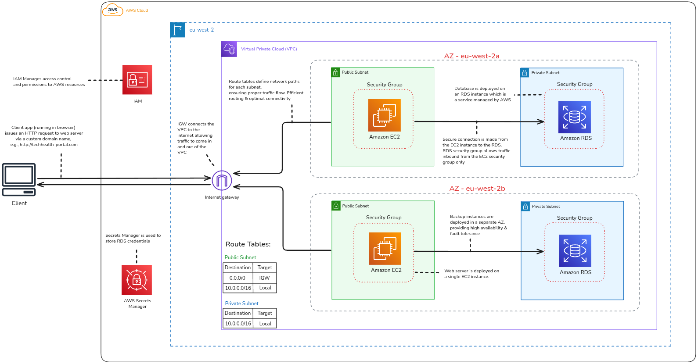
<br>
_Complete infrastructure architecture showing VPC, subnets, EC2, RDS, and security configuration_

### Components

**VPC (Virtual Private Cloud)**

- Isolated network environment in eu-west-2 region
- Spans 2 Availability Zones (eu-west-2a and eu-west-2b) for high availability
- CIDR: 10.0.0.0/16

**Availability Zones**

- AZ - eu-west-2a: Primary availability zone hosting EC2 and RDS instances
- AZ - eu-west-2b: Secondary availability zone with backup instances for fault tolerance

**Public Subnets**

- Internet-facing resources in each AZ
- Houses EC2 web servers
- Connected to Internet Gateway
- Route table: 0.0.0.0/0 → IGW (internet access)

**Private Subnets**

- Internal resources with no internet access in each AZ
- Houses RDS database instances
- Protected from direct internet exposure
- Route table: 10.0.0.0/16 → Local (VPC traffic only)

**Internet Gateway (IGW)**

- Connects the VPC to the internet
- Allows traffic to flow in and out of public subnets
- Routes traffic for client access to the web application

**Route Tables**

- Public Subnet routes: 0.0.0.0/0 → IGW, 10.0.0.0/16 → Local
- Private Subnet routes: 10.0.0.0/16 → Local (no internet route)

**Amazon EC2 Instances**

- Web application servers in public subnets
- Instance type: t2.micro (free tier eligible)
- Primary instance in eu-west-2a
- Backup instance in eu-west-2b for high availability
- Security group allows SSH from my IP and HTTP/HTTPS from anywhere

**Amazon RDS Instances**

- MySQL databases for patient data
- Instance type: db.t3.micro
- Located in private subnets (one per AZ)
- Only accessible from EC2 security group
- NOT publicly accessible
- Managed service by AWS with automated backups

**Security Groups**

- EC2 Security Group: Controls inbound traffic to web servers (SSH, HTTP, HTTPS)
- RDS Security Group: Allows MySQL (port 3306) from EC2 security group only
- Secure connection enforced from EC2 to RDS

**IAM (Identity and Access Management)**

- Manages access control and permissions to AWS resources
- EC2 instances use IAM roles to access other AWS services securely

**AWS Secrets Manager**

- Securely stores RDS database credentials
- EC2 instances retrieve credentials at runtime
- Eliminates hardcoded passwords in application code

**Client Access**

- Users access the patient portal via HTTP requests
- Traffic flows through Internet Gateway to EC2 instances in public subnets
- Custom domain: http://techhealth-portal.com

<br>

## Design Decisions

### Why Multi-AZ?

Healthcare applications require high availability. If one availability zone goes offline due to power failure or AWS maintenance, the infrastructure continues running from the other zone. For a patient portal where people access critical health information, downtime is unacceptable.

### Why separate subnets?

Public subnets are for resources that need internet access (web servers serving patients). Private subnets are for sensitive data that should never touch the internet (patient medical records). This architectural separation means even if the web server is compromised, attackers cannot directly access the database from the internet.

### Why no NAT Gateway?

NAT Gateways incur ongoing charges and allow private resources to initiate outbound internet connections. The RDS database doesn't need to reach the internet at all, so this would be wasted cost. Infrastructure as Code makes it easy to add later if requirements change.

<br>

## How This Solves TechHealth's Problems

### ✅ Security Problems solved:

- Database is now in a private subnet with no internet access
- Proper network segmentation between application and data tiers
- Security groups enforce least privilege access
- Multi-layer defense: even if one layer is breached, others still protect the data

### ✅ Operational Problems solved:

- Infrastructure is now code that lives in Git with full version control and history
- Can recreate entire environment in 5 - 10 minutes with `cdk deploy`
- Code IS the documentation and it's always accurate and up-to-date
- Can spin up identical dev, staging, and production environments easily

### ✅ Compliance Problems solved:

- Architecture now meets HIPAA technical safeguards requirements
- Database isolation protects patient health information
- All infrastructure changes are tracked and auditable
- Can prove security controls to auditors with code

### ✅ Business Impact solved:

- Developers can safely test in isolated environments
- Disaster recovery time reduced from days to minutes
- Reduced risk of data breaches and compliance violations
- Infrastructure changes are reviewable before deployment

<br>

## Cost Considerations

### No NAT Gateway

The RDS database doesn't need outbound internet access, so why pay for it? By eliminating the NAT Gateway, we avoid unnecessary monthly charges while maintaining the same level of security.

### Right-Sized Instances

- EC2 uses `t2.micro`
- RDS uses `db.t3.micro`

For a small patient portal, these smaller instances are perfectly adequate. As the number of users and requests grows, we can easily scale up based on actual usage metrics.

## Cost Management Strategy

It is vitally important that the infrastructure is destroyed when not in use by running:

```bash
cdk destroy
```

This deletes everything and stops all charges. Since we can recreate the entire infrastructure in just 5 minutes, we only run it when actively testing. This is the beauty of Infrastructure as Code.

<br>

## Infrastructure as Code Benefits

### Before (Manual Console)

- ❌ No version control
- ❌ Hard to replicate environments
- ❌ Documentation becomes outdated
- ❌ Human errors in configuration
- ❌ No way to review changes before applying
- ❌ Takes hours to rebuild

### After (CDK)

- ✅ Infrastructure in version control (Git)
- ✅ One command to create identical environments
- ✅ Code IS the documentation
- ✅ Type-safe with TypeScript (catches errors before deploy)
- ✅ Preview changes with `cdk diff`
- ✅ Rebuild in 5 minutes

### Real-World Impact

[Explain how this helps TechHealth Inc. Example:]

- Development team can spin up test environments instantly
- Security team can review infrastructure changes in pull requests
- Disaster recovery: Rebuild infrastructure in minutes
- Compliance audits: Infrastructure history in Git

<br>

## Setup Instructions

### Prerequisites

- Node.js 18+ installed
- AWS CLI configured with credentials
- AWS CDK installed: `npm install -g aws-cdk`

### Installation Steps

**1. Clone the Repository**

```bash
git clone https://github.com/amin-aws-cloud/techhealth-cdk-migration.git

cd techhealth-cdk-migration
```

**2. Install Dependencies**

```bash
npm install
```

This installs all required CDK libraries and TypeScript dependencies defined in package.json

**3. Bootstrap CDK (First Time Only)**

```bash
cdk bootstrap aws://YOUR-ACCOUNT-ID/YOUR-REGION
```

**4. Review Changes**

```bash
cdk diff
```

**5. Deploy Infrastructure**

```bash
cdk deploy
```

Save the outputs:

- EC2 Public IP
- RDS Endpoint

**6. Test Connectivity**

SSH to EC2:

```bash
ssh -i your-key.pem ec2-user@<EC2-PUBLIC-IP>
```

Connect to RDS from EC2:

```bash
sudo yum install mysql -y

mysql -h <RDS-ENDPOINT> -u admin -p
```

**7. Destroy Infrastructure**

```bash
cdk destroy
```

### Useful Commands

- `npm run build` - Compile typescript to js
- `cdk synth` - Generate CloudFormation template
- `cdk diff` - Compare deployed stack with current state
- `cdk deploy` - Deploy this stack to your default AWS account/region
- `cdk destroy` - Delete all resources

<br>

# Lessons Learned

## Challenges Faced

### 1. Understanding CDK Constructs

The hardest part wasn't AWS itself. It was wrapping my head around how CDK works with TypeScript. Coming from the AWS Console where you click buttons, suddenly I'm dealing with classes, constructors, scopes, and constructs.

The `this` keyword confused me at first. Why am I passing `this` as the first argument to every construct? It took me a while to understand that this refers to the Stack, and I'm building a tree of resources within that stack. Each construct needs to know its parent so CDK can build the hierarchy.

I figured it out by reading the CDK documentation examples and experimenting. I'd create a simple VPC, deploy it, break it, fix it, and redeploy. After a few iterations, the pattern clicked. Now I can look at any CDK code and understand what's happening.

---

### 2. Security Group Configuration

I initially tried to allow RDS access using the EC2 instance's IP address. That seemed logical: allow traffic from this specific IP. But CDK kept pushing me toward something different.

Turns out you reference the security group object itself, not IP addresses. This creates dynamic, scalable rules. If EC2 instances scale up or get new IPs, they're automatically authorized because they're in the right security group.

The solution was reading through AWS documentation on security group best practices and looking at real-world examples on GitHub. Once I understood security groups can reference each other, everything made more sense.

---

## Key Takeaways

- I can destroy and recreate this entire infrastructure in 5 minutes. That's genuinely wild.  
  In my first attempt, I messed up the security groups. Instead of carefully editing things in the console and hoping I didn't break anything, I just deleted everything with `cdk destroy` and redeployed with fixed code. Total time was 7 minutes. That's when Infrastructure as Code really clicked for me.

- Good security comes from good architecture, not from adding more rules.  
  By putting the database in a private subnet, I didn't have to configure complex firewall rules to block internet access. It's architecturally impossible to reach it from the internet. Security through design beats security through configuration.

- Building things in small steps works way better than trying to do everything at once.  
  I tried to write all the code at once initially: VPC, EC2, RDS, security groups, everything. It failed with cryptic errors. Then I switched to deploying VPC → testing → adding security groups → testing → adding EC2 → testing → adding RDS → testing. Each small step worked. This is how actual professionals work.

---

## Future Improvements

If I were deploying this for real production use, I would:

- Add an **Application Load Balancer** for better scalability and health checks
- Implement **Auto Scaling** for EC2 to handle traffic spikes automatically
- Enable **RDS Multi-AZ** for high availability in production environments

I would also:

- Move database credentials into **AWS Secrets Manager** instead of generating them in CDK
- Set up **CloudWatch alarms** to detect issues early
- Implement a proper **backup strategy** for RDS, including automated snapshots and point-in-time recovery

These improvements would be critical for any real healthcare application handling patient data.

<br>
<br>

## Screenshots

### CDK Deployment

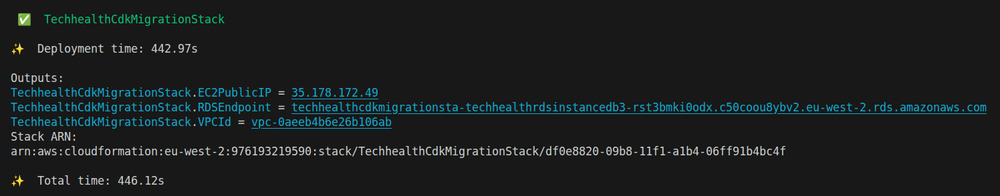
<br>
_Successful CDK deployment showing stack creation and outputs (EC2 IP and RDS endpoint)_

---

### VPC Configuration

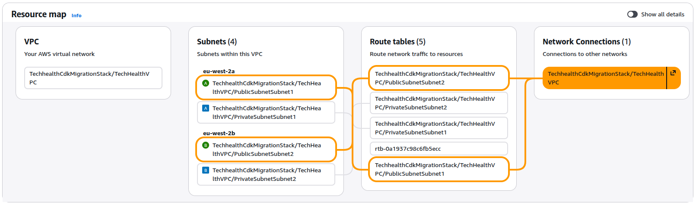
<br>
_VPC resource map showing 2 Availability Zones with public and private subnets_

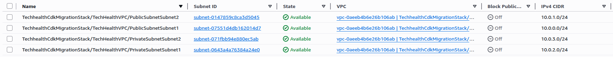
<br>
_Complete subnet configuration showing 2 public subnets and 2 private subnets across AZs_

---

### EC2 Configuration


<br>
_EC2 instance running in public subnet with public IP address_

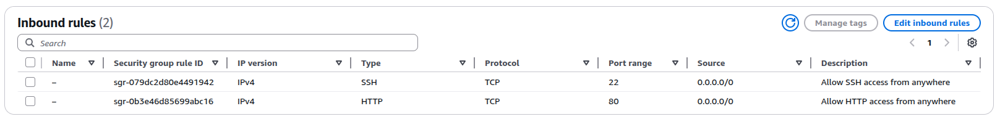
<br>
_EC2 security group showing inbound rules: SSH & HTTP from anywhere_

---

### RDS Configuration


<br>
_RDS database instance in private subnet with "Publicly accessible: No"_


<br>
_RDS connectivity settings confirming database is not publicly accessible_

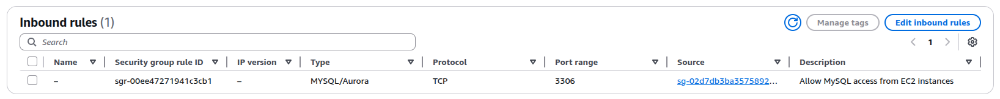
<br>
_RDS security group showing inbound rule: MySQL (3306) from EC2 security group only_

---

### Connectivity Testing

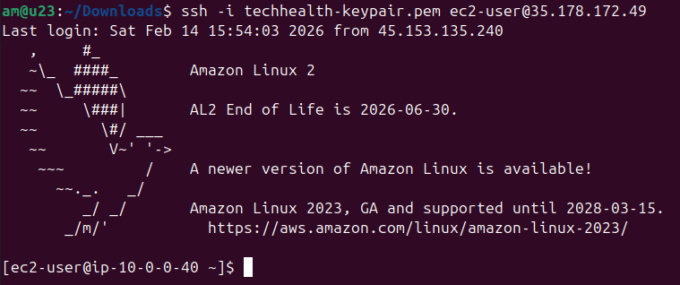
<br>
_Successful EC2 connection from my local machine_

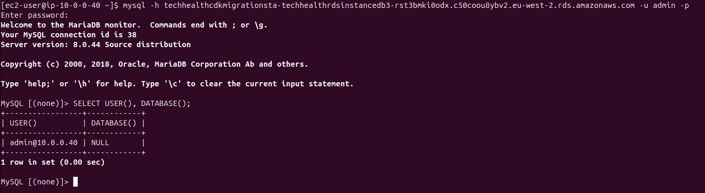
<br>
_Successful MySQL connection from EC2 instance to RDS database_

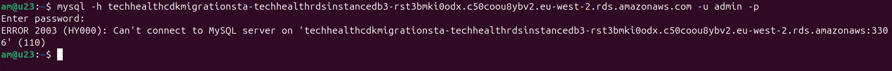
<br>
_Failed connection attempt from local machine to RDS, proving database is private_

---

### Route Tables

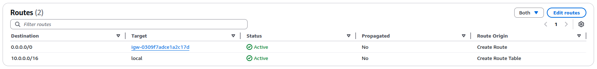
<br>
_Public subnet route table showing route to Internet Gateway (0.0.0.0/0 → IGW)_

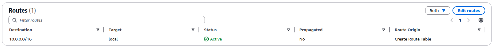
<br>
_Private subnet route table showing no internet route (local VPC traffic only)_

---

### Infrastructure Reproducibility


<br>
_Successful infrastructure destruction using cdk destroy command_

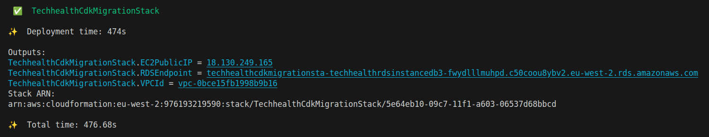
<br>
_Infrastructure successfully recreated, proving reproducibility of IaC approach_

---

### Code Structure


<br>
_CDK project file structure showing TypeScript stack definitions_


<br>
_Sample CDK TypeScript code showing VPC and security group configuration_

---
